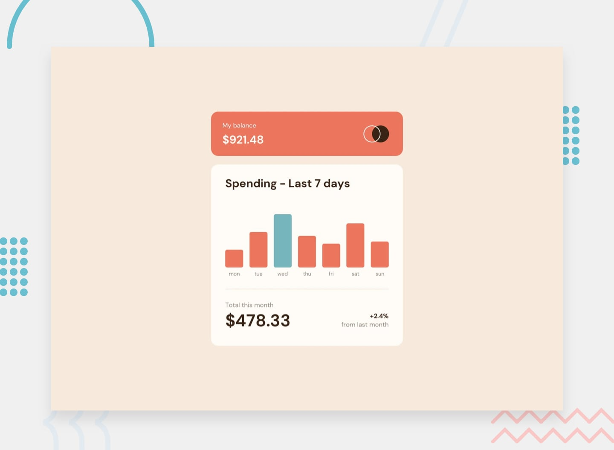

# Frontend Mentor - Expenses chart component

## Overview

I'm back to studying programming and I've started with the good old HTML and CSS, now I'm relearning JavaScript and TypeScript. After finishing the course I'm tackling some [Frontend Mentor](https://www.frontendmentor.io) challenges to put into practice everything I've learned as I continue my studies. It's also a great way to keep improving - while not forgetting everything I've learned - as I continue to learn new things.

### Live Demo

- [Live Demo](https://gasket-bamboo-flair.netlify.app)
- [Frontend Mentor Solution](https://www.frontendmentor.io/solutions/interactive-rating-component-ULxFOLNZtt)

## Frontend Mentor

[Frontend Mentor](https://www.frontendmentor.io) challenges help you improve your coding skills by building realistic projects.

The challenges are pretty straight forward, you have to replicate the page or element as closely as possible as the initial image or Figma layout - when provided.

### The Challenge

Your challenge is to build out this bar chart component and get it looking as close to the design as possible.

You can use any tools you like to help you complete the challenge. So if you've got something you'd like to practice, feel free to give it a go.

We provide the data for the chart in a local `data.json` file. So you can use that to dynamically add the bars if you choose.

Your users should be able to:

- View the bar chart and hover over the individual bars to see the correct amounts for each day
- See the current day's bar highlighted in a different colour to the other bars
- View the optimal layout for the content depending on their device's screen size
- See hover states for all interactive elements on the page
- **Bonus**: See dynamically generated bars based on the data provided in the local JSON file

## What I've Learned

### Simulating a Real API

The project only ships with a `data.json` file containing the last 7 days of spending, but the design also called for a balance card and a monthly summary with a percentage change from the previous month — neither of which can be derived from that single file.

Rather than hardcoding those values, I created two additional JSON files (`balance.json` and `monthlySummary.json`) to simulate separate API endpoints, each representing a distinct domain (account balance, monthly aggregation) the way a real backend likely would split them.

This meant fetching from three endpoints instead of one, and calculating the month-over-month percentage change client-side from real data rather than displaying a static string.

### DocumentFragment, <template>, and cloneNode()

My first working version generated each chart column by setting an inline `style.height` on existing `<li>` elements inside a `forEach` loop. It worked, but after digging into optimization with the help of AI, I learned this approach causes unnecessary reflows: each style mutation on an element already in the live DOM can trigger the browser to recalculate layout, and doing that seven times in a row (once per column) is wasteful compared to batching the work.

The fix involved three tools I hadn't used together before:

- **`<template>`**: holds inert, reusable HTML that the browser parses but never renders or executes — perfect for a markup "mold" you intend to stamp out multiple times.
- **`cloneNode(true)`**: creates a fresh, independent copy of that template's content on each iteration, avoiding the cost of re-parsing an HTML string from scratch every time.
- **`DocumentFragment`**: a lightweight container that lives outside the rendered DOM tree, letting me assemble all seven columns in memory first, and insert them into the page in a single `appendChild` call — so the browser recalculates layout once, not seven times.

I still don't fully grasp every nuance of the browser's rendering pipeline, but understanding _why_ batching DOM writes matters, and having a concrete pattern for doing it, was a genuinely useful addition to my toolkit.

### Accessibility and Semantic HTML

The bar chart is visual by nature — a `` with a computed height and a color doesn't mean anything to a screen reader on its own.

To bridge that gap, each generated chart column pairs a visually-hidden `sr-only` element (containing something like `"Monday: $17.45"`) with `aria-hidden="true"` on the purely decorative day label and bar itself.

This way, sighted users still see the bars and hover tooltips, while screen reader users get a clean, individually-navigable list of day/amount pairs — without needing `role="img"` or a single monolithic label that would collapse the whole chart into one unbreakable announcement.

### Architecture and Tooling

- **TypeScript**: used throughout, including generic functions and runtime type predicates (`value is X`) to validate the shape of data coming from each simulated endpoint before trusting it.
- **BEM (Block Element Modifier)**: applied consistently across the stylesheet for predictable, modular class naming.

## Built With

- Markup: HTML5, Semantic Elements
- Styling: CSS3 (Grid, Flexbox, Fluid Spacing using clamp()), BEM Architecture
- Logic & Tooling: TypeScript, Vite, Bun

## Author

[@psudo-dev](https://github.com/psudo-dev)

## License

This project is licensed under the MIT License - see the [LICENSE.md](./LICENSE.md) file for details
